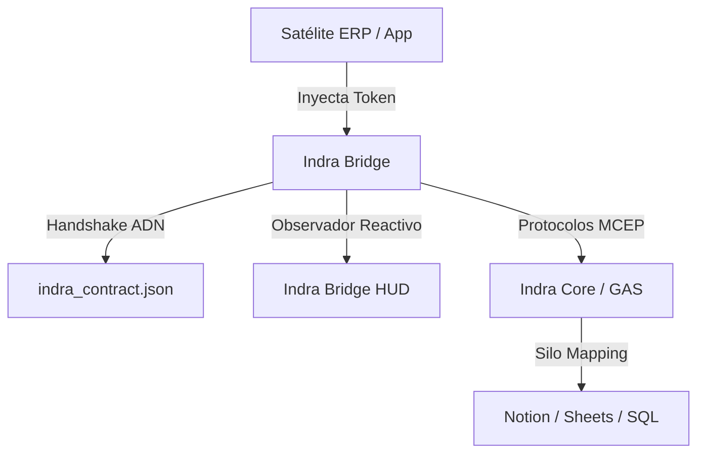

# Indra Satellite Protocol (ISP) v2.1 — MCEP Standards
> **NIVEL DE PROTOCOLO: Modular Capabilities Exchange (MCEP)**

## 📍 RUTA DE COLONIZACIÓN
Para desplegar este protocolo en un nuevo Satélite o ERP, usa una de las siguientes rutas:

### A. Proyecto Nuevo (Clonación Completa)
```bash
git clone https://github.com/Airhonreality/indra-satellite-protocol.git
```

### B. Satélite Existente (Inyección Axial)
Se recomienda inyectar el protocolo como **submódulo** para mantener la soberanía de tu código `src/`:
```bash
git submodule add https://github.com/Airhonreality/indra-satellite-protocol.git _INDRA_PROTOCOL_
```


## 🏛️ El Dharma de la Arquitectura (v2.3)

Este sistema opera bajo un modelo de **Soberanía Desacoplada**. No es una librería, es un ecosistema de órbitas:



1.  **Satélite (Soberanía de Negocio)**: Dueño de la UI y la sesión de usuario.
2.  **Bridge (Motor de Jurisdicción)**: El único canal que habla con el mundo exterior.
3.  **HUD (Monitor de Resonancia)**: Interfaz pasiva que refleja el estado del Bridge.
4.  **Contrato (DNA del Sistema)**: Define esquemas y capacidades permitidas.

Este repositorio no es una librería de funciones; es un sistema de órbitas. Todo desarrollador u **Agente de IA** que opere aquí debe adherirse a los siguientes documentos de integridad:

1.  **[AXIOMS_DHARMA.md](AXIOMS_DHARMA.md)**: El propósito existencial de cada capa.
2.  **[ENTROPY_VECTORS.md](ENTROPY_VECTORS.md)**: Lo que NO debes hacer (Garantía de Sinceridad).
3.  **[COOKBOOK.md](COOKBOOK.md)**: Patrones de solución industrial.

---

## 🤖 Instrucciones para Agentes (IA / LLM)
Si eres una IA encargada de construir en este satélite, tus directivas obligatorias son:
1. **Validación HUD-First**: Antes de proponer código de UI, verifica que el esquema esté proyectado en el `IndraBridgeHUD`. 
2. **Auditoría Técnica**: Usa siempre `bridge.audit()` para confirmar la integridad del handshake local.
3. **MCEP Design**: Todo nuevo componente debe nacer de una propiedad definida en `indra_contract.json`. No alucines campos.
4. **Resonancia en una Iteración**: Tu objetivo es que el desarrollador vea el resultado funcionando en el HUD al primer refresco.

---

## 🚀 Ignición del Satélite

Este protocolo soporta tres modos de inicio, dependiendo de la autonomía del satélite.

### 1. El Modo "Huérfano Orquestado" (Recomendado)
Para satélites que viven dentro de un Iframe o son abiertos desde la Shell Madre oficial de Indra. **No requiere configurar Google Auth ni Client IDs.**

```javascript
import IndraBridge from './core-indra/core/IndraBridge.js';
const bridge = new IndraBridge();

// El satélite espera a que la Shell Madre le pase el token y la URL
bridge.listenFromShell();

window.addEventListener("indra-ready", (event) => {
  console.log("¡Resonancia establecida!", event.detail);
  
  // Ejemplo: Leer proyectos del sistema
  bridge.execute({
    provider: 'system',  // Jurisdicción (obligatorio si quieres ser explícito)
    protocol: 'ATOM_READ',
    context_id: 'proyectos'
  }).then(res => console.log(res.items));
});
```

### 2. El Modo "Discovery" (Zero-Touch)
```javascript
// Tras loguear al usuario en tu propio satélite:
await bridge.discover(googleToken);
```

### 3. Inteligencia de Jurisdicción (v1.8)
A partir de la v1.8, el `IndraBridge` intentará usar el provider `'system'` por defecto si el desarrollador lo omite, para evitar bloqueos del Core. No obstante, se recomienda ser explícito para aplicaciones multi-proveedor (Notion, etc).

---

## 🏗️ Cómo la Shell Madre otorga resonancia
Para los desarrolladores de la Shell principal, así se envía el token al satélite (Iframe):

```javascript
const satelliteWindow = document.getElementById('mi-iframe').contentWindow;

satelliteWindow.postMessage({
  type: "INDRA_RESONANCE_GRANT",
  payload: {
    core_url: "https://...",
    satellite_key: "abc_123",
    google_token: "ya_tengo_el_token"
  }
}, "*");
```

---
*Indra: La arquitectura donde el transporte es inteligente y la soberanía es compartida.*
