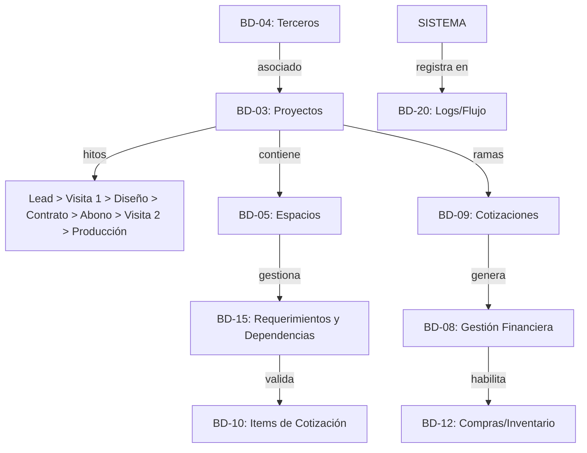

# 🏛️ INDRA DATA_MASTER: Índice de Bases de Datos (Veta de Oro)

Este documento define la estructura atómica y las relaciones de datos del ecosistema ERP. Todos los esquemas siguen el **Protocolo Dimensional de Veta de Oro**.

---

## 🗺️ Mapa de Relaciones Esenciales

---

## 📦 Detalle de Schemas (Evolucionado)

### BD-04: Registro Universal de Terceros (`bd_terceros`)
- **ID:** `TER-[SEC]`
- **Roles:** [CLIENTE, PROVEEDOR, EMPLEADO, CONTRATISTA] (Multiselect).

### BD-03: Gestión de Proyectos (`bd_proyectos`)
*El contenedor de la transformación del espacio.*
- **ID:** `VETA-[AÑO]-[SEC]`
- **Fase_Actual:** [LEAD, DISEÑO, CONTRATADO, EN_PRODUCCIÓN, INSTALACIÓN, ENTREGADO].
- **Hito_Manual:** `Contrato_Firmado` (Trigger manual desde el Dashboard).
- **Hito_Automático:** `Pago_Validado` (Trigger financiero).

### BD-05: Espacios del Proyecto (`bd_espacios`)
*El motor jerárquico que agrupa el diseño y captura requerimientos técnicos.*
- **ID:** `ESP-[SEC]`
- **Protocolo de Contenido:** Se actualiza iterativamente en Visita 1 y Visita 2 (Producción).

### BD-15: Checklist de Requerimientos y Dependencias (`bd_items_requerimientos`)
- **ID:** `REQ-[SEC]`
- **Estado de Cumplimiento:** `BOOLEAN` (Cumplido / Pendiente).
- **Log_Variación:** Texto libre para registrar acuerdos variables con el cliente.

### BD-08: Gestión Financiera y Contratos (`bd_financiero`)
*Gestión del flujo de caja por proyecto.*
- **ID:** `FIN-[SEC]`
- **Relación:** Cotización_ID (Link BD-09) + Proyecto_ID.
- **Campos Core:**
  - `Valor_Contrato`: CURRENCY (Derivado de BD-09 aprobado).
  - `Abono_Reserva`: CURRENCY (Monto del primer pago).
  - `Comprobante_Pago_URL`: URL (Imagen/PDF).
  - `Estado_Pago`: [PENDIENTE_PAGO, ABONADO, PAGADO_TOTAL].
- **Lógica:** El `Hito_Automático` de BD-03 se dispara cuando `Estado_Pago` >= `ABONADO`.

### BD-09: Cotizaciones y Variantes (`bd_cotizaciones`)
- **Estado:** [BORRADOR, ENVIADA, APROBADA (CONTRATADA), ARCHIVADA].
- **Regla:** Al generar contrato, el estado pasa a `APROBADA` y se bloquea la edición de sus items (BD-10).

### BD-10: Items de Cotización y Producción (`bd_items_cotizacion`)
- **Estado_Taller:** [PLANOS_LISTOS, EN_CORTE, EN_ENSAMBLE, LISTO_DESPACHO].

### BD-11: Catálogo Canónico de Módulos (`bd_catalogo`)
- **Protocolo Dimensional:** `alto`, `ancho`, `profundo` (Obligatorio).

### BD-12: Compras e Inventarios (`bd_compras`)
- **ID:** `OC-[SEC]`
- **Lógica:** Solo se habilitan compras para proyectos en estado `EN_PRODUCCIÓN`.

### BD-20: Logs y Flujo de Trabajo (`bd_logs_sistema`)

---

## 🛠️ Protocolos de Automatización (Triggers)

1.  **[Botón] Generar Contrato:** Genera PDF legal + Bloquea BD-10 + Actualiza BD-03 a `CONTRATADO`.
2.  **[Evento] Validación de Pago:** Actualiza BD-08 + Cambia BD-03 a `EN_PRODUCCIÓN` + Dispara Tarea de "Segunda Visita de Remedición".
3.  **Protocolo de Segunda Visita:** El Dashboard de campo se re-activa para capturar medidas de alta precisión técnicas (Templating) sin borrar la info de la primera visita.
